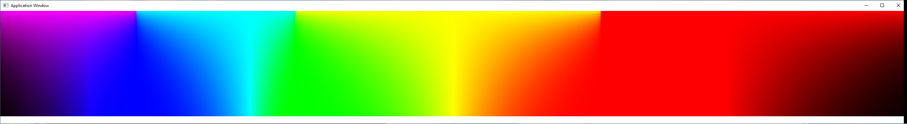
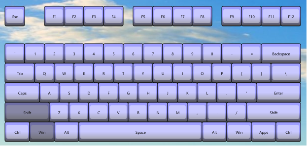
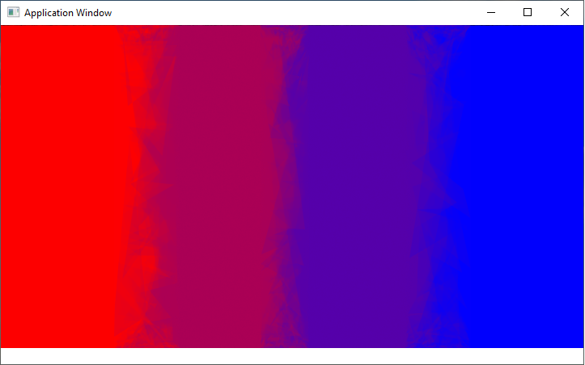
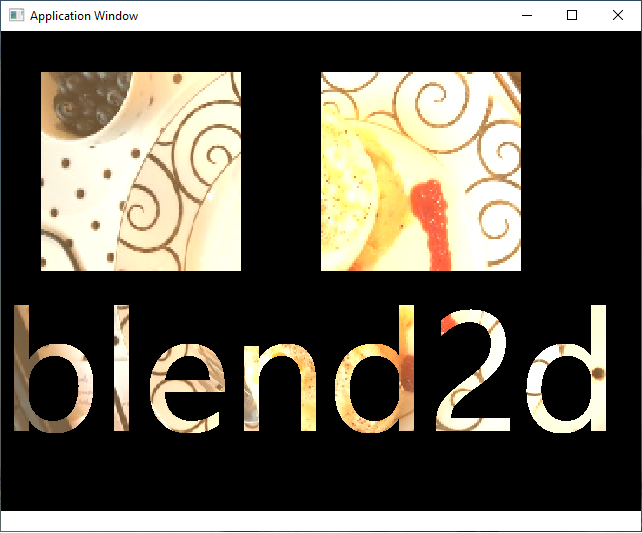
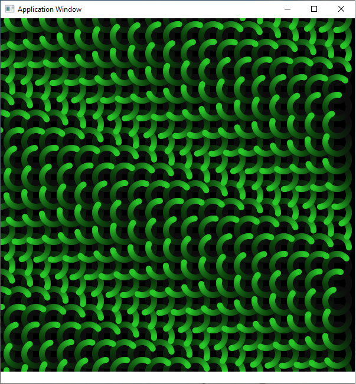

# ndt
Newgrammer Development Tools
============================

A repository of simple applications for new programmers.

These programs are written in C++, and exhibit various concepts
from data structures, algorithms, threading, memory management
and the like.

All the platform specific parts of creating a window, handling
mouse, keyboard, joystick and the like are conveniently wrapped up
for easy consumption.

Examples
========

### analogclock
</br>
* Project: [analogclock](projects/analogclock)
* Notes: animation, transparency, rotation

### bannersketch
</br>
* Project: [bannersketch](projects/bannersketch)
* Notes: semi-transparent, full screen overlay

### calendar
</br>
* Project: [calendar](projects/calendar)
* Notes: Text of different sizes, calendar object

### colorama
</br>
* Project: [colorama](projects/colorama)
* Notes: rgb color from frequency, gamma adjust

### compkeyboard
</br>
* Project: [compkeyboard](projects/compkeyboard)
* Notes: transparent window, raw global keyboard input, data structures

### desktoplife
</br>
* Project: [desktoplife](projects/desktoplife)
* Notes: desktop, automata, rectangle drawing

### finalysis
</br>
* Project: [finalysis](projects/finalysis)
* Notes: windows, file drop, file stream

### lerpcolor
</br>
* Project: [lerpcolor](projects/lerpcolor)
* Notes: Linear interpolation of color, fast polygon fill

### lsystem
</br>
* Project: [lsystem](projects/lsystem)
* Notes: lindemeyer system, whole desktop transparency

### parimage
</br>
* Project: [parimage](projects/parimage)
* Notes: pixel effects (masking, tinting)

### pubit
</br>
* Project: [pubit](projects/pubit)
* Notes: pubsub, event topics, joystick, mouse, keyboard

### rain
</br>
* Project: [rain](projects/rain)
* Notes: fullscreen, particles, desktop interaction

### rainbow
</br>
* Project: [rainbow](projects/rainbow)
* Notes: color blending, fullscreen, transparency

### ratiow
</br>
* Project: [ratiow](projects/ratiow)
* Notes: ray tracer, buttons

### remoter
</br>
* Project: [remoter](projects/remoter)
* Notes: encode, decode graphics commands

### screenplanes
</br>
* Project: [screenplanes](projects/screenplanes)
* Notes: pixel operations to separate color planes, screen capture

### shapes
</br>
* Project: [shapes](projects/shapes)
* Notes: drawing path based shapes

### simchain
</br>
* Project: [simchain](projects/simchain)
* Notes: simulated springs, full screen, semi-transparent

### sinwave
</br>
* Project: [sinwave](projects/sinwave)
* Notes: display sin and cosine functions

### sketchy
</br>
* Project: [sketchy](projects/sketchy)
* Notes: drawing program, mouse, path, pen

### snapview
</br>
* Project: [snapview](projects/snapview)
* Notes: screen snapshot, mipmap

### spirograph
</br>
* Project: [spirograph](projects/spirograph)
* Notes: screen snapshot, mipmap

### squardle
</br>
* Project: [squardle](projects/squardle)
* Notes: drop shadows, painter's algorithm drawing

### starfield
</br>
* Project: [starfield](projects/starfield)
* Notes: animation, full screen

### svgcolors
</br>
* Project: [svgcolors](projects/svgcolors)
* Notes: Display colors from SVG palette, scroll with mouse wheel

### targaviewer
</br>
* Project: [tgaviewer](projects/tgaviewer)
* Notes: Display bitmap from .tga file

### wavemaker
</br>
* Project: [wavemaker](projects/wavemaker)
* Notes: follow the mouse, using trig functions

Compiling
=========
    * apphost.h
    * appmain.cpp


Graphics are supported by the blend2d library.  Other than that, there are no other external dependencies.

In the directory structure, the '\primary' directory contains
a bunch of very useful stuff that makes the programming super
easy to play with.  The most direct and easy way to get started is to use the p5 combination of files

    * p5.hpp
    * p5.cpp

This will give you an environment wherein you only need to implement a couple of functions to put something on the screen.  It is very similar to the original Processing environment, or p5.js, but done in C++

```C++

void setup()
{
    createCanvas(640,480);
}


void draw()
{
    // draw a rectangle
    rect(10,10,100,100);
}
```


The code here is windows specific, which makes no attempt at being cross platform.  All windows specifics are encapsulated in the apphost/appmain combination though, so if you want to try your hand at doing cross platform things, porting those two files is pretty much all you would have to deal with.

The projects directory contains a Visual Studio solutions file which gives you ready access to all the coded up examples.

Install a relatively recent version of the Visual Studio environment, to get a Visual C++  compiler installed.  Currently
using Visual Studio 2019

Open up the projects.sln file in the \projects\projects.sln
Make sure you're in Release mode
Build the entire solution, play with examples

Creating a new project
======================
Need to link in: ws2_32.lib, blend2d.lib
Need to set Additional Lib Directories to ..\..\lib\Release

Need to set C/C++ Additional Include Directories - ..\..\primary
Need to set C++ runtime to /Mt


Bits And Bobs
=============


Most functions in ndt are encapsultated in classes that are in header files.  That means ndt does not have a 'library' that programs link against.  Each program is individual, and compiles down to a fairly small size.


Random References
==========


https://github.com/Wiladams/NewTOAPIA

C++ compiler intrinsics
https://docs.microsoft.com/en-us/cpp/intrinsics/compiler-intrinsics?view=vs-2019

VS Code c++ task configuration
https://code.visualstudio.com/docs/cpp/config-msvc


Things to try
=============
Processing and P5 worlds are full of great things to play with.

* http://haptic-data.com/toxiclibsjs/examples/force-directed-graph-p5
* https://natureofcode.com/book/


